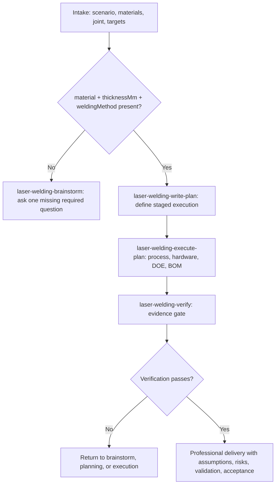

# Laser Welding (Official Skill)

## Overview

End-to-end laser welding solution support: intake -> process window -> hardware and automation -> DOE -> BOM -> delivery verification.

This is the official workflow router. It decides which stage skill to use, keeps domain guardrails visible, and makes sure every recommendation remains traceable to user inputs, structured output, catalog/reference material, or explicit assumptions.

## When To Use

- New laser welding or laser brazing project
- Push-pull wire-feed brazing head selection
- Brazing or filler wire family guidance
- Material, thickness, joint, coating, or defect process assessment
- Turnkey automation line, fieldbus, fixture, safety, or BOM request
- DOE planning or pre-delivery verification
- Process parameter tuning, monitoring loop, safety interlock, or recipe management request

## Hard Rules

- Never provide pricing, quotation, cost estimation, simulation, or finite element analysis.
- Use available structured tools internally for numeric process, hardware, DOE, fieldbus, and BOM outputs; do not ask the user whether tools are available.
- For welding/process answers, final answers must not mention tool availability, tool calls, MCP, fallback mode, or internal orchestration. Mention tooling only when the user explicitly asks about integration or setup.
- Do not invent process values, PLC timings, OEM-specific settings, certified filler grades, or production release claims.
- Every numeric recommendation is heuristic and requires DOE and trial weld validation.
- Treat laser welding parameters as a system: laser energy, optics/focus, motion, scan/wobble, shielding, cooling, monitoring, safety, and recipe control all interact.
- Tuning order matters: confirm position and joint first, set energy/focus second, then tune shielding/cooling and scan/motion, then freeze the validated recipe.
- Brand names are candidate examples, not endorsements.
- Push-pull brazing must include wire-feed head, feeding geometry, brazing wire family, and validation risks.
- Motion architecture recommendations must keep multiple candidates when scope allows (for example: gantry, single-axis rotary, industrial robot, collaborative robot) and define switch conditions.
- A complete solution requires at least `material`, `thicknessMm`, and `weldingMethod`; missing recommended inputs become assumptions and risks.
- High-risk gate (`isBatteryCopperRing` concept): when the scenario is battery, material is copper (including purple copper), and intent is ring/circular welding, treat this as a gated routing path before any specific head recommendation.
- For ring welding, `ringDiameterMm` is a required field; keep `thicknessMm` explicit and validated together.
- Under the battery-copper-ring gate, if `material`, `thicknessMm`, `weldingMethod`, or `ringDiameterMm` (when welding method is ring seam) is missing, ask one focused question each turn and do not finalize head architecture.

## Shared Language And Artifact Rules

- Follow `references/shared-rules.md` for language and artifact naming/path rules.
- In this router skill, artifact type depends on stage output (`brainstorm`, `plan`, `solution-report`, `verification`).

## Stage Decision Tree

1. New or underspecified project -> use `laser-welding-brainstorm`.
2. Required inputs are present but execution steps are not defined -> use `laser-welding-write-plan`.
3. Written execution plan exists -> use `laser-welding-execute-plan`.
4. Defect-only request -> use `defect_diagnose` internally, then verify whether the process context is sufficient.
5. Advanced BOM or line request -> use `hardware_recommend` and `solution_bom` internally when inputs are sufficient.
6. Before any final answer that claims completeness or readiness -> use `laser-welding-verify`.

## Audience Routing (Decision Pack / RFQ Pack)

Default output mode is `dual-pack` when user does not specify audience.

- `customer-decision`: management-readable feasibility gate and rollout conditions.
- `vendor-rfq`: supplier-facing technical specification and evidence requirements.
- `dual-pack`: provide both outputs in one response with clear section split.

Routing hints:

- If user asks "是否适合导入新产线 / can we adopt this process", prioritize `customer-decision`.
- If user asks "找设备厂商 / technical indicators / 招标参数", prioritize `vendor-rfq`.
- If user asks both, enforce `dual-pack`.

## Process Flow

## MCP Tools

| Tool | Stage | Use |
| --- | --- | --- |
| `process_recommend` | End-to-end | Simplified input for process parameters, equipment selection, DOE, BOM, risks, validation, and acceptance |
| `material_assess` | Process | Material pair, coating, initial process window, parameter families, weld mode, brazing wire family warning |
| `hardware_recommend` | Solution | Laser, head, wire-feed head, motion, brand filtering, validation plan |
| `doe_matrix` | Validation | Power, speed, defocus, gap, wire speed, wire angle, preheat, gas, clamp force, pulse, wobble, nozzle, cooling |
| `defect_diagnose` | Validation | Defect-driven parameter corrections |
| `trajectory_generate` | Automation | G-code or motion hints |
| `fieldbus_map` | Automation | OPC UA, PROFINET, EtherCAT mappings |
| `solution_bom` | Delivery | BOM, layout, assumptions, missing inputs, risk, validation, acceptance |

## Stage Handoff Contract

Every stage hands the next stage these fields when known:

- Scenario and user role
- Known inputs
- Missing required inputs
- Missing recommended inputs
- Explicit assumptions
- Risk level
- Process mode: fusion, brazing, polymer transmission, seal welding, battery tab, busbar, or custom
- Parameter families: laser, optics/focus, motion, scan/wobble, shielding gas, cooling/auxiliary
- Tuning workflow: target/joint -> energy/focus -> shielding/cooling -> scan/motion -> observe/refine -> recipe release
- Monitoring plan: vision position, seam tracking when needed, power feedback, temperature, reflected light, and spot quality where relevant
- Safety and recipe controls: interlocks, alarms, locked parameters, operator-editable fields, and review triggers
- Required validation evidence
- Next recommended stage

When stage output is `solution-report`, you MUST trigger one `AskQuestion` interaction for high-impact assumptions before drafting the report body. The interaction is non-blocking in content (the user may skip all), but the interaction step itself is required.

## When To Stop And Ask For Help

Stop and ask one focused question when:

- `material`, `thicknessMm`, or `weldingMethod` is missing for a complete recommendation.
- In ring seam welding (including battery copper ring), `ringDiameterMm` is missing.
- The requested scope includes pricing, commercial quotation, simulation, finite element analysis, certified filler approval, or direct production release.
- The user asks for production readiness without DOE and trial weld evidence.
- Structured output and user constraints conflict in a way that changes the recommendation.

## When To Revisit Earlier Stages

Return to `laser-welding-brainstorm` when required inputs change or were misunderstood.

Return to `laser-welding-write-plan` when the delivery scope changes, an automation/BOM requirement is added, or assumptions need a new execution sequence.

Return to `laser-welding-execute-plan` when a plan is still valid but a tool output or reference result must be regenerated.

## Anti-Patterns

- Producing a complete solution without at least material, thickness, and welding method.
- Ignoring joint type, coating, fixture, takt, safety, or validation.
- Treating power, speed, and defocus as isolated values instead of part of the wider parameter system.
- Tuning scan/wobble before confirming position, focus, and baseline energy.
- Omitting monitoring, safety interlocks, or recipe locking when the request is production, RFQ, or turnkey oriented.
- Mixing brazing and fusion welding without declaring the mode.
- Treating push-pull wire-feed brazing as only a generic wire feeder.
- Omitting brazing wire family in a brazing request.
- Claiming production readiness without DOE or trial weld evidence.
- Exposing internal orchestration in a normal professional answer.
- Recommending a specific head type when `ringDiameterMm` or `thicknessMm` is missing.
- Giving only a single architecture under high takt requirements.

## Installation

| Channel | How |
|---------|-----|
| Claude Code plugin | Use `.claude-plugin/plugin.json`; see [claude-code.md](references/claude-code.md) |
| Cursor plugin | Use `.cursor-plugin/plugin.json`; see [cursor.md](references/cursor.md) |
| Codex plugin | Use `.codex-plugin/plugin.json`; see `.codex/INSTALL.md` |
| OpenCode plugin | Use `.opencode/plugins/laser-welding.js`; see `.opencode/INSTALL.md` |
| MCP (npx) | `npx -y @ethermeta/lasernexus mcp` |

## Permanent Out Of Scope

Pricing, quotation, cost estimation, simulation, finite element analysis, OEM real-time connection, certified filler grade approval, brand endorsement, and direct production release promises.

## References

- [cursor.md](references/cursor.md)
- [claude-code.md](references/claude-code.md)
- [solution-intake.md](references/solution-intake.md)
- [brazing-wire.md](references/brazing-wire.md)
- [wire-feed-heads.md](references/wire-feed-heads.md)
- [materials.md](references/materials.md)
- [process-window-heuristics.md](references/process-window-heuristics.md)
- [solution-report-template.md](references/solution-report-template.md)
