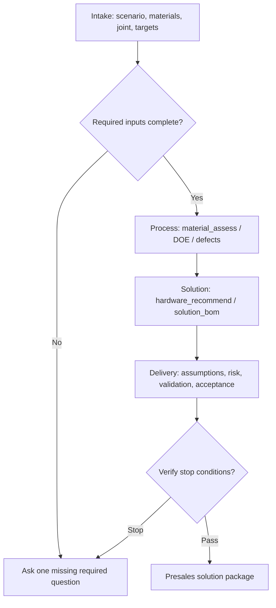

# Laser Welding (Official Skill)

End-to-end laser welding solution support: intake -> process window -> hardware and automation -> DOE -> BOM -> delivery verification.

## When To Use

- New laser welding or laser brazing project
- Push-pull wire-feed brazing head selection
- Brazing or filler wire family guidance
- Material, thickness, joint, coating, or defect process assessment
- Turnkey automation line, fieldbus, fixture, safety, or BOM request
- DOE planning or pre-delivery verification

## Hard Rules

- Never provide pricing, quotation, cost estimation, simulation, or finite element analysis.
- If MCP `lasernexus` / `@ethermeta/lasernexus` is connected, call the MCP tools for numeric process, hardware, DOE, fieldbus, and BOM outputs.
- Do not invent process values, PLC timings, or OEM-specific settings.
- Every numeric recommendation is heuristic and requires DOE and trial weld validation.
- Brand names are candidate examples, not endorsements.
- Push-pull brazing must include wire-feed head, feeding geometry, brazing wire family, and validation risks.

## Decision Tree

1. New or underspecified project -> use `laser-welding-brainstorm`.
2. Requirements are ready -> use `laser-welding-write-plan`.
3. Plan exists -> use `laser-welding-execute-plan`.
4. Defect-only request -> use `defect_diagnose`, then verify whether process context is sufficient.
5. BOM or line request -> use `hardware_recommend` then `solution_bom`.
6. Before final answer -> use `laser-welding-verify`.

## Process Flow

## MCP Tools

| Tool | Stage | Use |
| --- | --- | --- |
| `material_assess` | Process | Material pair, coating, initial process window, weld mode, brazing wire family warning |
| `hardware_recommend` | Solution | Laser, head, wire-feed head, motion, brand filtering, validation plan |
| `doe_matrix` | Validation | Power, speed, defocus, gap, wire speed, wire angle, preheat, gas, clamp force |
| `defect_diagnose` | Validation | Defect-driven parameter corrections |
| `trajectory_generate` | Automation | G-code or motion hints |
| `fieldbus_map` | Automation | OPC UA, PROFINET, EtherCAT mappings |
| `solution_bom` | Delivery | BOM, layout, assumptions, missing inputs, risk, validation, acceptance |

## Anti-Patterns

- Producing a complete solution from only material and thickness.
- Ignoring joint type, coating, fixture, takt, safety, or validation.
- Mixing brazing and fusion welding without declaring the mode.
- Treating push-pull wire-feed brazing as only a generic wire feeder.
- Omitting brazing wire family in a brazing request.
- Claiming production readiness without DOE or trial weld evidence.

## Installation

| Channel | How |
|---------|-----|
| Claude Code plugin | Use `.claude-plugin/plugin.json` from the repository root |
| Codex plugin | Use `.codex-plugin/plugin.json`; see `.codex/INSTALL.md` |
| OpenCode plugin | Use `.opencode/plugins/laser-welding.js`; see `.opencode/INSTALL.md` |
| MCP (npx) | `npx -y @ethermeta/lasernexus mcp` |

## Permanent Out Of Scope

Pricing, quotation, cost estimation, simulation, finite element analysis, OEM real-time connection, certified filler grade approval, brand endorsement, and direct production release promises.

## References

- [solution-intake.md](references/solution-intake.md)
- [brazing-wire.md](references/brazing-wire.md)
- [wire-feed-heads.md](references/wire-feed-heads.md)
- [materials.md](references/materials.md)
- [process-window-heuristics.md](references/process-window-heuristics.md)
